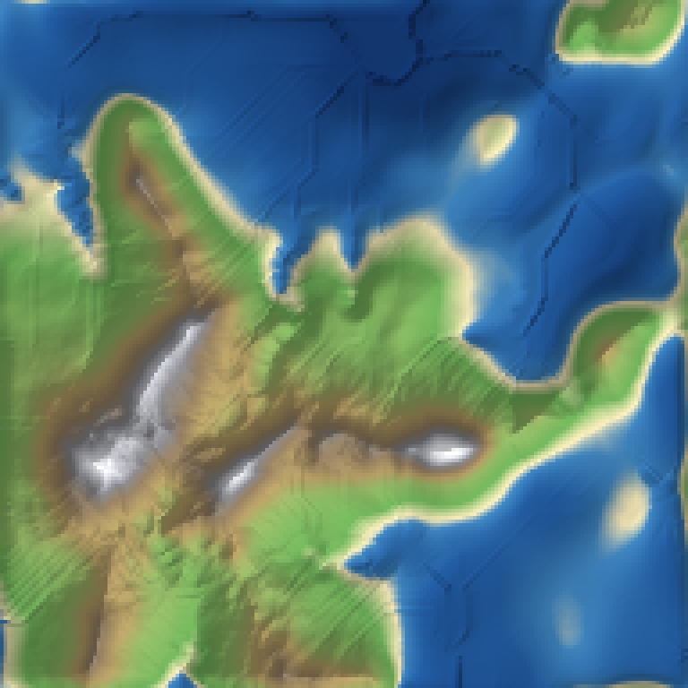
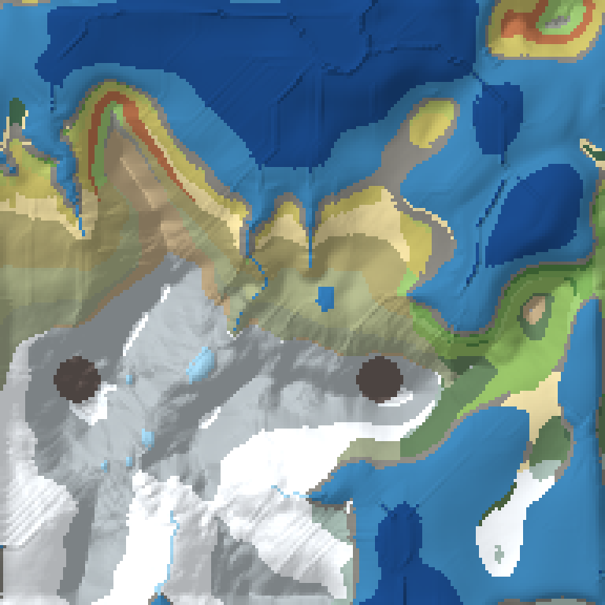
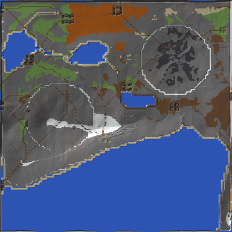

# MAP-generator.

A Minecraft terrain generator you can run as a desktop app: **build** a world, **preview it
in 3D**, and **export it to a folder you choose** as a real Java Edition save (Anvil `.mca`
region files + `level.dat`) that the game loads straight from `saves/`.

The generator is an original engine (Python + numpy, no mod code) that borrows the *ideas*
of four famous worldbuilding tools:

| Inspiration | What was taken from it |
| --- | --- |
| **Lithosphere** | Climate-driven worldgen: continents/oceans/islands with gradual coastlines and wide beaches, large temperature & humidity regions so biomes are big and smooth instead of speckled, rivers that carve deep valleys, swamps confined to low ground, overhauled caves. |
| **Still Life** | Population data: natural biome variants plus transitional biomes, high tree/shrub/flower density, cave biomes, and structure placement driven by where people would actually settle. |
| **Streams Reflowing** | Hydrology: priority-flood basins, per-cell flow direction, flow accumulation, watersheds, lakes that actually hold water, rivers that widen downstream and end at the sea instead of drying up in a cave. |
| **World Machine / World Painter** | Node-graph-style terrain construction: continents → mountains → plateaus → terracing → thermal/fluvial erosion → deposition, plus a WorldPainter-style export bundle (16-bit heightmap, water, biome and flow maps) for hand-editing in WorldPainter. |

Everything runs offline. There is no Java, no Minecraft install and no internet access
involved in generating a world.

| Elevation map | Biome map | Exported world, re-decoded from the `.mca` |
| --- | --- | --- |
|  |  |  |

*(all three are the `cinematic` / `worldmachine` presets: 768–384 blocks at cell size 4)*

---

## The Ashenfall deliverable: the continent of Vantyra

Alongside the generic presets the engine carries **one specified world**:
`ASHENFALL_WORLD_MAP_MASTER_SPECIFICATION.pdf`'s 8,000 x 8,000 continent of Vantyra, built
by a dedicated fourth-generation engine (`mg/generation/ashenfall.py` + `landform.py` +
`landmarks.py`) rather than coaxed out of the generic chain. The turnkey command is the
specification's own:

```bash
python generate_ashfall.py --res 2048 --out worldpainter     # the spec's command
python generate_ashfall.py --out anvil --cell 4 --dir out    # a mod-ready Minecraft world
python generate_ashfall.py --out both --cell 4               # both, one pass
```

| Output | What it is |
| --- | --- |
| `ASHENFALL_HEIGHTMAP_16BIT.png` | 16-bit heightfield, `uint16 = round(((Y + 64) / 384) * 65535)` |
| `ASHENFALL_POPULATE_MASK.png` | the Still Life populate mask (spec §5, method 1) |
| `ASHENFALL_WATER_MASK.png`, `..._SLOPE_MASK.png`, `..._SCREE_MASK.png`, `..._FROST_MASK.png`, `..._BIOME_MAP.png` | the build layers, one raster each |
| `ASHENFALL_SURFACE_TABLE.json` | the spec §6 surface rule as data |
| `ashenfall_worldpainter_setup.js` | JSR-223 script that reconstructs the world in WorldPainter |
| `<dir>/minecraft/Ashenfall/` | a real Java 1.21.1 save: `level.dat` + Anvil region files |

A generated build of all of the above is checked in at [`assets/ashenfall/`](assets/ashenfall/), so the map's build layers can be taken straight
into WorldPainter without running anything.

The nine cardinal landmarks sit at their specified coordinates and elevations - The
Forgotten Coast (spawn) `(0, 68, 2500)`, the Cogwork March `(-2100, 0)`, the Ashen Caldera
`(0, 0)` with its 146-block rim and 92-block Obsidian Throne, the Solitary Glacial Spine
`(0, -2500)`, the Gilded Dunes `(2300, 0)` with black-glass crests, the Whispering Fen
`(2000, 2000)`, the Sunken Reach `(-2400, 1600)`, the Hermit's Spire `(-1800, -1800)` and
the Byzantine Choir `(1800, -1800)` - inside a finite continent whose shelf falls away
along the spec's cubic Hermite dropoff (`t = clamp((r - 3300) / 500)`,
`H_drop = -600 * (3t^2 - 2t^3)`) into the Veil of Salt.

**The export is deliberately left undecorated**, exactly as spec §5 method 1 requires:
chunks are written as `minecraft:features`, never `minecraft:full`, so Lithosphere and
Still Life place their own features when the world loads, driven by the populate mask
instead of by our guesses. The same preset is available everywhere else in the app:

```bash
python3 -m mg.cli generate --preset ashenfall --out ~/.minecraft/saves   # cell size 4
python3 -m mg.cli presets                                                # includes "Ashenfall - Vantyra"
```

A full-resolution build (cell size 4 -> 4,000,000 simulation cells, 250,000 chunks) takes
roughly ten minutes to generate and forty to export on two cores; `export.resume` is on,
so an interrupted export continues from the chunks already written.

Two details of the build are worth knowing, because both are places where the specification
and a naive terrain generator disagree:

* **The shaped landforms are kept dry.** A quarry bench, a dune swale and a caldera rim all
  enclose closed sub-basins, and a depression filler would flood every one of them - the
  first build filled 39% of the caldera, 25% of the Cogwork March and 15% of the Gilded
  Dunes with lakes. The water system therefore takes a `no_lake` mask for those regions:
  no standing water, but rivers still cross them (a stronger `no_water` mask would take the
  rivers with it, which is only right for the lava basin).
* **The landmark centres are re-pinned after hydrology.** The spec lists an exact elevation
  for each of the nine centres; erosion and river carving move the ground a few blocks, so
  the pin is re-applied to the finished surface - radius-limited and capped at 6 blocks -
  which lands all eight ground-level centres within 0.25 blocks of the specification. The
  caldera is exempt: its centre is the Obsidian Throne, at the spec's Y = 92.

---

## Quick start

### 1. Run it live in a browser (no install)

```bash
cd "/home/user/MAP-generator."
python3 -m mg.desktop --serve-only --port 8791
```

Then open `http://localhost:8791/`. Pick a preset, press **Generate world**, orbit the
result, then set an output folder and press **Export world**.

### 2. Run it as a windowed desktop app

```bash
python3 -m mg.desktop          # native window via pywebview, browser fallback
python3 -m mg.desktop --browser   # force the default browser
```

### 3. Build the single-file executable

```bash
python3 -m pip install pyinstaller pywebview   # pywebview optional
python3 tools/build_exe.py                     # -> dist/mapgen.exe (Windows) / dist/mapgen
python3 tools/build_exe.py --onedir            # faster start, folder build
python3 tools/build_exe.py --check             # pre-flight only, build nothing
```

PyInstaller cannot cross-compile: run this on the OS you want the binary for. On a stock
Debian/Ubuntu system Python you also need the shared-library package
(`libpython3.11` / `libpython3.12`), otherwise the pre-flight check stops you with a clear
message instead of a crash. Windows one-click: `tools\build_exe.bat`.

### 4. Drive it from the command line

```bash
python3 -m mg.cli presets                                  # list the 8 presets
python3 -m mg.cli generate --preset cinematic --size 2048 --seed 42 --out ~/.minecraft/saves
python3 -m mg.cli map      --preset desert --size 1024 --kind biome --resolution 2048 --out desert.png
python3 -m mg.cli inspect  --preset rainforest --size 512 --x 128 --z 128
python3 -m mg.cli serve    --port 8791
```

`--set key.path=value` overrides any config field, e.g.
`--set water.river_threshold=500 --set erosion.fluvial_iterations=20`.
`--save-config cfg.json` writes the exact config used, which you can feed back with
`--config cfg.json`. Ready-made configs live in `presets/`.

### 5. Use it from Python

```python
from mg.config import default_config, RegionInfo
from mg.pipeline import run_pipeline
from mg.export.world import export_world

cfg = default_config()
cfg.region = RegionInfo(blocks_x=2048, blocks_z=2048, cell_size=4)
cfg.seed = 42
result = run_pipeline(cfg, progress=lambda f, m: print(f"{f:5.1%} {m}"))
out = export_world(result.terrain, cfg.to_dict(), "~/.minecraft/saves", seed=cfg.seed)
print(out.chunks, "chunks ->", out.world_dir)
```

---

## What ends up in the save folder

```
<output>/<World Name>/
├── level.dat              # seed, spawn point, generator metadata, time-of-day
├── level.dat_old
├── session.lock
├── region/r.0.0.mca       # standard Anvil region files, zlib/gzip chunks
├── maps/                  # PNG map bundle + legend.json (height, biome, climate, …)
├── worldpainter/          # heightmap.png (16-bit), water.png, biomes.png, flow.png
├── schematic/             # optional WorldEdit .schem tiles (Sponge Schematic v2)
├── mapgen.json            # the exact config that produced this world
└── README.txt             # what this world is, in-world spawn coords, how to reload
```

Copy the folder into `.minecraft/saves/`, launch Minecraft Java 1.21, and it is playable.
Water, beaches, rivers, lakes, caves, ores, trees, roads and settlement structures are all
already in the chunk data — no mods or datapacks required.

See **[docs/USAGE.md](docs/USAGE.md)** for every control in the UI and
**[docs/ARCHITECTURE.md](docs/ARCHITECTURE.md)** for how the pipeline works and where to
extend it.

## Tests

```bash
python3 -m unittest discover -s tests     # 61 tests: core maths, pipeline, exporters
```

All three test modules run offline and take a few seconds; they cover noise/hydrology/erosion
maths, end-to-end pipeline invariants (shape agreement, river widening downstream, seed
reproducibility, every preset), and byte-level checks of the NBT/Anvil/schematic writers
including a reference bit-unpacker that re-decodes exported chunks.
