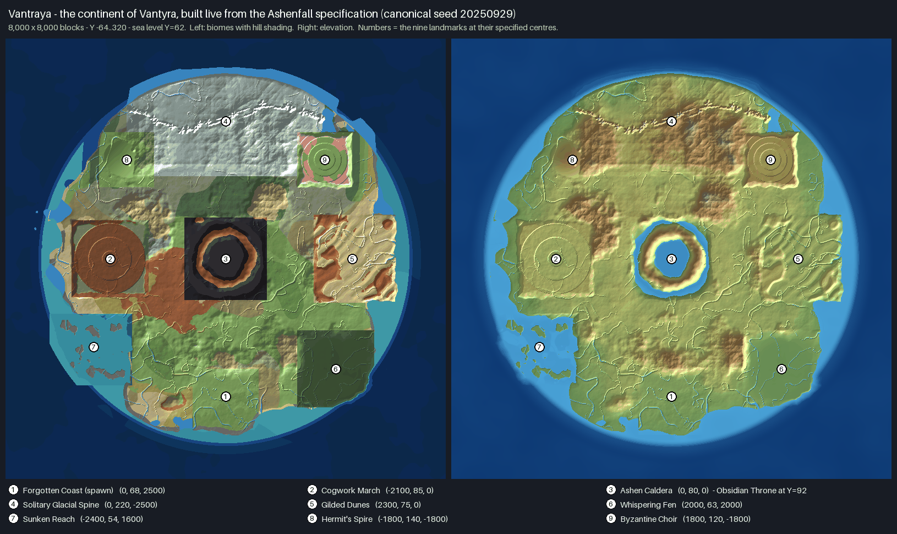

# Vantraya Builder

A NeoForge mod for **Minecraft 1.21.1** that builds the continent of **Vantyra** (the world of *Ashenfall*) **live, from its specification**, the moment you create a world with the **Vantraya** world type. Nothing is exported and no save file has to be shipped: the 8,000 × 8,000-block continent is generated chunk by chunk from the specification's tables and formulas, so the landmarks are where the spec puts them and the rest of the world is texture around them — *not random completely*.



It is built to run **alongside** the worldgen mods in the pack — Lithosphere, Still Life, Tectonic, Lithostitched — see [how that works](#working-alongside-lithosphere-still-life-and-tectonic).

> **Status.** The specification model is complete and heavily tested, and the mod now **runs inside the real game engine** in CI. GitHub Actions compiles it against the real NeoForge 21.1.176 / Minecraft 1.21.1 jars and runs **94 tests, all passing** ([run](https://github.com/Exo2v/MAP-generator./actions/runs/37054994965)): 81 plain JUnit tests (the spec tables, a numeric cross-check against the offline Python generator this was ported from, the shipped noise-router JSON evaluated by an independent interpreter) and **13 that start Minecraft** — an in-memory server whose data is loaded by the game's own loader — and check the Vantraya world type there: the preset on the creation screen's list, the density functions, the generator and biome source, real generated chunks at every landmark, the specification's own verification on eight world seeds. The workflow also uploads the mod jar as a build artifact. **It has not been played**: nobody has opened the world creation screen, picked the preset and walked around, and none of the companion mods was available to test with. The first thing to do is create a world with it and run `/vantraya verify`. See [Status and known limits](#status-and-known-limits).

## Using it

1. Install **NeoForge 1.21.1** and drop the jar from [`builds/`](builds/) — `vantraya-builder-neoforge-1.21.1-<version>.jar` — into `mods/` (clients and server).
2. *Create New World → World → World Type → **Vantraya*** (it sits with Default, Superflat, Large Biomes and Amplified). Dedicated server: `level-type=vantraya_builder:vantraya` in `server.properties`.
3. You spawn on the **Forgotten Coast** at (0, 68, 2500), the specification's spawn.

Existing worlds cannot be converted; the generator is chosen when a world is created.

## What the world is

The data below is the specification (`HANDOFF.md` §3, the master specification PDF) — pinned by unit tests, and every ground-level centre is generated at *exactly* its specified Y for every seed — in the model, through the shipped noise-router JSON, and by the real game engine (see [Status](#status-and-known-limits)).

| # | Landmark | Centre (x, y, z) | Box (x · z) | Y band | Biomes |
|---|----------|------------------|-------------|--------|--------|
| 1 | Forgotten Coast *(spawn)* | 0, 68, 2500 | ±600 · 2000…3200 | 68–74 | plains, meadow |
| 2 | Cogwork March | −2100, 85, 0 | −2800…−1400 · ±700 | 85–110 | windswept hills, wooded badlands |
| 3 | Ashen Caldera | 0, 80, 0 *(Obsidian Throne Y = 92)* | ±750 · ±750 | 38–150 | basalt deltas, eroded badlands |
| 4 | Solitary Glacial Spine | 0, 220, −2500 | ±1800 · −3500…−1500 | 180–279 | frozen peaks, jagged peaks, grove |
| 5 | Gilded Dunes | 2300, 75, 0 | 1600…3100 · ±800 | 75–94 | desert, badlands |
| 6 | Whispering Fen | 2000, 63, 2000 | 1300…2700 · 1300…2700 | 62–66 | swamp, mangrove swamp |
| 7 | Sunken Reach | −2400, 54, 1600 | −3200…−1700 · 1000…2300 | 50–62 | warm ocean, lukewarm ocean |
| 8 | Hermit's Spire | −1800, 140, −1800 | −2300…−1300 · −2300…−1300 | 140–185 | windswept hills, meadow |
| 9 | Byzantine Choir | 1800, 120, −1800 | 1300…2300 · −2300…−1300 | 110–145 | meadow, cherry grove |
| – | **Veil of Salt** | ring, r > 3550 | — | −32…62 | deep cold ocean, deep ocean |

* **Shape.** A coast radius that varies with compass bearing (the continent reaches furthest north, closest in the south-west), a Hermite shelf dropoff beyond r = 3300 and the brine abyss beyond r = 3550 (the specification's *H_drop = −600·S(t)*, clamped at the abyss floor Y = −32).
* **Climate.** The five tiers of the spec, `T_eff = T_base − 0.0055·max(0, y − 62)`, per-landmark temperature/humidity windows — plus the spec's *mandatory 600-block non-snowy boreal belt* around the Glacial Spine, which the offline generator never enforced.
* **Surface.** The slope-aware table — grass < 25°, coarse dirt/podzol on 40 % of 25–35° columns, scree on 35–45° (5 % mossy boulders), bare granite above 45°, snow/calcite above the Y = 225 treeline, volcanic rock throughout the caldera, black-glass dune crests, salt crust on the Veil floor. Trees need soil, so this is what keeps vegetation (vanilla's or any mod's) off cliffs and summits.
* **Water.** Rivers and lakes carved into the lowlands (valleys strongest where the ridges field is ≈ 0), no ponds on the dry landforms, **no water at all inside the caldera**, where the crater floor gets lava basins instead.
* **Seeds.** The world seed varies coastline, relief, river courses and the Glacial Spine's peak layout; the landmarks never move. `canonicalWorld = true` always builds the shipped Ashenfall continent. Seed comparison: [`docs/img/vantraya-seeds.png`](docs/img/vantraya-seeds.png).

## Commands

| Command | Who | What it does |
|---|---|---|
| `/vantraya info` | everyone | the nine landmarks and the Veil |
| `/vantraya where` | everyone | landmark, climate tier and fields at your feet |
| `/vantraya locate <landmark>` | everyone | centre, box and elevation of a landmark |
| `/vantraya tp <landmark>` | ops | teleport to a landmark |
| `/vantraya verify` | ops | **acceptance test of the running world**: reads the real generator and noise router (not the model) and checks every landmark's elevation and biome, the caldera's throne/floor/rim, the spawn, and the Veil floor |
| `/vantraya biomes <namespace>` | ops | list a mod's biome IDs — for adding them to a [biome role tag](docs/COMPATIBILITY.md#adding-another-mods-biomes) |

F3 shows a `Vantraya:` line with the landmark, height, climate tier and the density fields at the cursor.

## Configuration

`config/vantraya_builder-common.toml`:

| Option | Default | Meaning |
|---|---|---|
| `canonicalWorld` | `false` | `true`: ignore the world seed, always build the shipped Ashenfall continent |
| `spawnAtForgottenCoast` | `true` | start new worlds at the specification's spawn |
| `paintSurface` | `true` | apply the slope-aware surface table after the biome surface rules |
| `keepCalderaDry` | `true` | drain the crater and pour its lava basins |
| `enforceWorldBorder` | `false` | 8,000-block border centred on the origin, applied once to a fresh world |
| `logCompatReport` | `true` | log detected companion mods and data packs and biome-tag contributions at server start |

## Working alongside Lithosphere, Still Life and Tectonic

Lithosphere and Tectonic each replace `minecraft:overworld`'s noise settings; Still Life (which itself requires Lithosphere) replaces the vanilla surface biomes with its own. Any one of them would normally conflict with a second terrain generator, so Vantraya **does not touch `minecraft:overworld`**: the world type ships its own dimension type, noise settings and generator, and the three mods keep working for every other world type. What is shared:

* **Everything keyed to vanilla biomes and tags** — biome modifiers that add features or spawns, structure mods (Towns and Towers, Dungeons and Taverns …) — applies, because Vantraya uses vanilla-namespace biomes.
* **Biome role tags.** Each biome role (`temperate_forest`, `xeric_shrubland`, …) is a tag, `#vantraya_builder:biome/<role>`, holding the vanilla default. Add Still Life's (or Biomes O' Plenty's …) biomes to a tag and Vantraya spreads them over exactly the places that role covers. `/vantraya biomes <namespace>` lists the IDs.
* **Lithostitched** worldgen modifiers that target the overworld level stem should apply to Vantraya's overworld (by construction; untested).

**Who decorates.** The handoff's export contract was "the mods decorate, vanilla does not". A live world has no deferred decoration step, so by default Vantraya places **vanilla biomes and vanilla's own features run**. To let Still Life (or another biome mod) decorate *instead*, put its biomes into the role tags with `"replace": true` — [how](docs/COMPATIBILITY.md#adding-another-mods-biomes). Its biome IDs are not in this repository (unknown to me), so that mapping is yours to supply; `/vantraya biomes <namespace>` lists them.

Details, the exact facts about each mod, and what is *not* done are in [`docs/COMPATIBILITY.md`](docs/COMPATIBILITY.md). The short honest version: Vantraya's *terrain* is the specification's, not Lithosphere's or Tectonic's; their terrain shaping is not borrowed because it would break the specification's exact elevations.

## Building

Requires JDK 21.

```bash
./gradlew build          # compile, run all tests, then put vantraya-builder-neoforge-1.21.1-<version>.jar in builds/ (and build/libs/)
./gradlew runClient      # dev client
./gradlew runServer      # dev server
```

CI (`.github/workflows/build.yml`) does `./gradlew build`, uploads the jar as a workflow artifact and — for a push on which every test passed — commits it to [`builds/`](builds/), so the jar in the repository is always one that passed its tests ([`builds/README.md`](builds/README.md) says how to tell which source it was built from). The specification model (`io.github.exo2v.vantraya.core`) is plain Java without any Minecraft dependency, so its tests also run with a bare JDK and JUnit 4. The in-engine tests (`src/test/java/.../engine`) need the real game jars, so they run only under Gradle (`./gradlew test`); they start an in-memory server — no Minecraft EULA, no world on disk.

## Repository layout

```
src/main/java/io/github/exo2v/vantraya/
  core/   the specification as pure Java: Spec (tables), VantrayaModel (the continent), Landforms, Instances,
          BiomeLogic, SurfaceLogic, SpecVerifier ... — no Minecraft imports
  mc/     the thin Minecraft layer: VantrayaField (density function), VantrayaChunkGenerator,
          VantrayaBiomeSource, SurfacePainter, CalderaFluids, VantrayaCommand, config, spawn
src/main/resources/data/vantraya_builder/   world preset, noise settings, density functions, dimension type, biome role tags
src/test/        67 + 14 + 13 tests (spec tables, Java-vs-Python parity, model invariants, router JSON evaluation, in-engine world type)
scripts/generate_data.py   regenerates the worldgen JSON from vanilla 1.21.1 data
docs/            DESIGN.md · COMPATIBILITY.md · SPEC_NOTES.md · img/
HANDOFF.md, *.pdf, *.md      the specification documents this implements
```

## Status and known limits

**Verified here**

* The model reproduces the offline Python generator: on the specification's full 8,000 × 8,000 canvas the height field differs by 0.04 blocks on average (p99 1.0, max 3.2) with the same instance tables; landmark ownership, lava and no-water masks match 100 %; continentalness outside landmarks matches exactly. (`ParityTest` keeps a 560-point golden file from the Python run.)
* Every ground-level landmark centre is at exactly its specified Y — for the canonical seed and six others — both in the model and through the shipped noise-router JSON evaluated by an independent interpreter (`RouterTest`).
* The world type's JSON is internally consistent (all references resolve; presets, tags and biome role tags match the code).

**Verified by CI** (GitHub Actions, `./gradlew build` on Ubuntu with JDK 21)

* The Minecraft-facing classes compile against the real NeoForge 21.1.176 jars, and the mod jar is assembled.
* All 94 tests pass: the 81 plain JUnit tests, and **13 that run inside the real game engine** (NeoForge's `unitTest` environment with its ephemeral server — an in-memory `MinecraftServer` whose data is loaded by Minecraft's own `WorldLoader`; nothing is written to disk, no server is started, no EULA is involved). Those check, on the real engine:
  * the codecs and registries are registered; the Vantraya preset loads, is in `#minecraft:normal` (the creation screen's list), and its dimension, noise settings, density functions and biome role tags all load; the dimension survives the encode → decode round trip that saving `level.dat` performs; the `/vantraya` command tree is registered;
  * **the specification's own verification (`SpecVerifier`, 22 checks) passes on the live density-function engine for eight different world seeds**, and the world seed reaches the density functions;
  * real chunks from `fillFromNoise` at all nine landmarks: ground within ±1 of the specified Y, rock to the bottom, air at the build limit; the Obsidian Throne is obsidian; the Caldera holds no open water and gets lava on its floor; steep faces keep no soil; the abyss is deep sea;
  * the biome source, driven by the real `Climate.Sampler`, places a specified biome at every landmark centre.
* What running it that way found and fixed: terrain 2–4 blocks too high at landmark centres (vanilla's density bend interpolated upward — see [DESIGN §4](docs/DESIGN.md#4-how-minecraft-is-made-to-build-it)); the slope-aware surface table and the Caldera's lava being applied one block too low; a vanilla cave entrance opening a 17-block pit in the Hermit's Spire's pinned top (landmark centres are now kept free of surface cave entrances); and a server-start NPE that could only happen on a server with no levels.

**Not verified — please check on first run**

* **Play.** The in-engine tests cannot reach a player in a world: the vanilla surface-rule pass (`buildSurface` needs a `WorldGenRegion`; the painter is called directly instead), feature decoration, structure placement, mob spawning, the world creation *screen* (client UI) and the spawn placement are untested, and `/vantraya` is checked to be registered, not executed. `/vantraya verify` is the first thing to run in a new Vantraya world; if the world fails to load, the log lines starting with `Vantraya:` and the first exception are what is needed.
* **Interaction with the companion mods** has been designed for, not tested — none of them could be downloaded in my environment.

**Deliberate differences from the offline generator** (and from the documents): see [`docs/DESIGN.md`](docs/DESIGN.md#5-what-is-different-from-the-offline-generator-and-why) and [`docs/SPEC_NOTES.md`](docs/SPEC_NOTES.md) — the global stages (erosion, hydrology, rain shadow) are replaced by local equivalents, a few specification ambiguities were resolved with documented defaults, and not-yet-specified things (structures, the giant fungal trees) are left to the mods, as in the handoff.

## License

Not yet chosen — `mod_license` in `gradle.properties` is *All Rights Reserved*. The vanilla data files copied into the world type (noise settings' surface rule, dimension type) are Mojang's.
